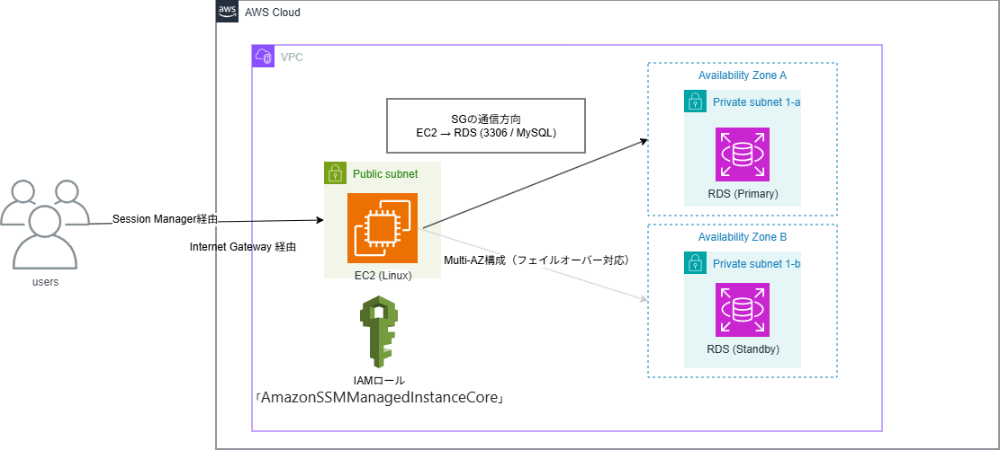

# aws-cfn-private-rds-ssm
CloudFormationを用いたEC2、RDS、SSMの自動構築テンプレート

## 概要（何を作ったか・目的）
CloudFormation を用いて、EC2、RDS、SSM を組み合わせ、SSM(Session Manager) から EC2 に接続して RDS を操作できる環境を自動構築するテンプレートを作成しました。

本テンプレートの目的は以下です：

- SSM(Session Manager)や IaC（Infrastructure as Code）の理解  
- VPC、サブネット、EC2、RDS のネットワーク設計とセキュリティ設計の理解

## 構成 / アーキテクチャ



## 検証時の構成
- RDS は Private Subnet に配置  
- SSM(Session Manager) 経由で EC2 に接続し、RDS を操作可能  
- RDS は Multi-AZ 構成で障害発生時は自動的にスタンバイ AZ へフェイルオーバー  
- RDS の Security Group は特定 EC2 からの接続のみ許可しており、セキュリティも考慮

## 使用技術

### AWS
- **Amazon VPC**  
  - Public / Private Subnet を想定した新規作成
- **Amazon RDS (MySQL)**  
  - MySQL 8.0、Multi-AZ 構成（フェイルオーバー対応）  
  - DB Subnet Group で AZ 分散
- **Amazon EC2**  
  - RDS への接続元として利用
- **AWS Secrets Manager**  
  - RDS マスターユーザー名・パスワードを管理
- **AWS CloudFormation**  
  - インフラをコードとして管理（IaC）
- **AWS Systems Manager Session Manager**  
  - EC2 接続用に利用
- **IAM ロール**  
  - EC2 に SSM 接続用の `AmazonSSMManagedInstanceCore` 権限を付与

### ネットワーク
- **EC2 Security Group**  
  - アウトバウンド全許可(セキュリティ制御はRDSインバウンド SG側で実施)
- **RDS Security Group**  
  - 特定 EC2 SG からの通信のみ許可
- **IGW**  
  - Public Subnet 内 EC2 が外部通信および SSM(Session Manager) で接続できるよう設定
- **ルートテーブル**  
  - IGW と VPC を接続するルートを設定

### 設計・その他
- **draw.io**：構成図作成  
- **GitHub**：テンプレートおよび README 管理

## CloudFormation構成の説明
本テンプレートでは、CloudFormation を用いて以下を自動構築します：

- VPC、Public / Private Subnet  
- Security Group（EC2 / RDS）    
- IGW、ルートテーブル  
- IAM ロール  
- EC2、RDS（MySQL）

### ポイント
- DB の認証情報は Secrets Manager で管理  
- DB Subnet Group に複数 AZ を指定、`MultiAZ: true` で高可用性を確保  
- スタックはネットワーク、セキュリティ、Secrets Manager、EC2、RDS に分割し、役割を明確化

## デプロイ方法
1. CloudFormation でスタックを作成
2. **作成順序**  
   1. `network-stack`  
   2. `security-stack`  
   3. `secrets-stack`  
   4. `ec2-stack`  
   5. `rds-stack`
3. SSM(Session Manager) 経由で EC2 に接続して RDS にアクセス 
   ```以下 RDS 接続コマンド```
   ```bash mysql -h <RDSエンドポイント> -P 3306 -u <ユーザ名> -p ```

## 工夫・学習したポイント
- **Parameters** を活用し、異なる環境でも再利用可能なテンプレート設計  
- **Multi-AZ 有効化**による高可用性構成  
- **Secrets Manager による認証情報管理**でテンプレート内にパスワードを平文で記載しない  
- **Outputs 定義**で RDS エンドポイントや Secret ARN を即座に参照可能  
- スタックごとに処理を分割し、役割を明確化  
- **SSM(Session Manager) 経由接続**により SSH よりセキュリティを考慮  
- **RDS SG の制限**により特定 EC2 からの通信のみ許可

## 開発中に直面した課題と解決策

### 問題1
EC2 サブネットに IGW およびルートテーブルが適切に関連付けられていなかったため、外部接続が確立できなかった。  

**解決策**：ルートテーブルおよび IGW アタッチを CloudFormation に追加

### 問題2
EC2 Security Group のアウトバウンドに RDS 接続（TCP 3306）が未定義だったため、RDS へ接続不可となった。  

**解決策**：EC2 Security Group のアウトバウンドを全許可に変更
